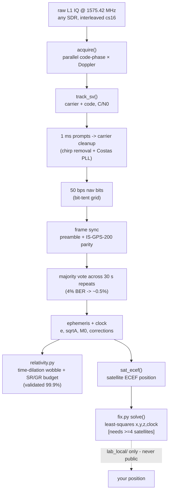

# GPSTuna 🛰️ — a software GPS receiver from raw SDR IQ  *(beta)*

Point any SDR at 1575.42 MHz, record a few minutes of the raw L1 hiss, and this
turns it into satellite orbits, a relativity experiment, and — with enough sky —
your own position. No GPS chip; just the antenna, the radio, and the math.

**Status:** the receiver *works* — it acquires satellites, tracks them, decodes
the 50 bps navigation message (parity-checked, majority-voted), and computes each
satellite's orbit. The **position fix** is implemented and its math validated;
it needs a capture with ≥4 satellites (an antenna with sky view) to converge —
that's the beta line.

## What it already does
- **Decodes the GPS nav message** from your own capture — ephemeris, clock terms,
  week number, timestamps — via preamble frame-sync, IS-GPS-200 parity, and a
  majority vote across the 30-second subframe repeats (drives ~4% bit errors to
  ~0.5%).
- **Measures Einstein.** `relativity.py` turns the decoded orbit into the
  satellite's relativistic clock behaviour: the ±39 ns per-orbit eccentricity
  wobble, and the special + general relativity budget — which matches the GPS
  factory clock detune (−4.4647×10⁻¹⁰) to **99.9%**. Time dilation, from a wire
  in the yard.

  
- **Computes satellite positions.** `fix.py`'s ephemeris→ECEF (Kepler + all
  harmonic corrections + Earth rotation) validates against the GPS orbit shell
  (a decoded PRN gives |r| ≈ 26,100 km).
- **Ionospheric scintillation** (`scint.py`) — S4 + phase indices from the same
  tracking, as a space-weather bonus.

## Architecture


## Run it
```bash
python measure.py  --iq your_capture.cs16 --selftest   # sanity (synthetic -20 dB)
python relativity.py --iq your_capture.cs16            # decode Einstein
python fix.py --validate                               # satellite-position math
python fix.py --iq your_4sat_capture.cs16              # position fix (>=4 birds)
```
Capture tip: an antenna at a window or a ~$10 active GPS patch antenna sees 8–12
satellites; indoors you may see only 1–2.

## Privacy
`fix.py` writes any computed position **only** to `lab_local/` (gitignored). The
IQ captures are gitignored too (satellite geometry encodes your location). The
code is public; your coordinates never are.

## Lineage
Built from the `radio-grid-atlas` GPS-L1 work; the C/A generator and acquisition
follow IS-GPS-200. Part of the "Tuna" family of SDR tools.
