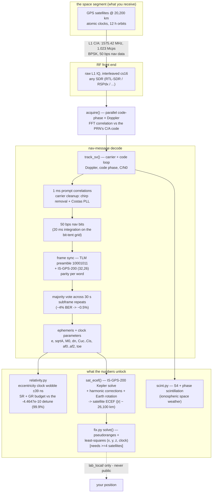

# GPSTuna 🛰️ — a software GPS receiver from raw SDR IQ  *(beta)*

Point any SDR at 1575.42 MHz, record a few minutes of the raw L1 hiss, and this
turns it into satellite orbits, a relativity experiment, and — with enough sky —
your own position. No GPS chip; just the antenna, the radio, and the math.

**Status:** the receiver *works* — it acquires satellites, tracks them, decodes
the 50 bps navigation message (parity-checked, majority-voted), and computes each
satellite's orbit. The **position fix** is implemented and its math validated;
it needs a capture with ≥4 satellites (an antenna with sky view) to converge —
that's the beta line.

## What it already does
- **Decodes the GPS nav message** from your own capture — ephemeris, clock terms,
  week number, timestamps — via preamble frame-sync, IS-GPS-200 parity, and a
  majority vote across the 30-second subframe repeats (drives ~4% bit errors to
  ~0.5%).
- **Measures Einstein.** `relativity.py` turns the decoded orbit into the
  satellite's relativistic clock behaviour: the ±39 ns per-orbit eccentricity
  wobble, and the special + general relativity budget — which matches the GPS
  factory clock detune (−4.4647×10⁻¹⁰) to **99.9%**. Time dilation, from a wire
  in the yard.

  
- **Computes satellite positions.** `fix.py`'s ephemeris→ECEF (Kepler + all
  harmonic corrections + Earth rotation) validates against the GPS orbit shell
  (a decoded PRN gives |r| ≈ 26,100 km).
- **Ionospheric scintillation** (`scint.py`) — S4 + phase indices from the same
  tracking, as a space-weather bonus.

## Architecture (full signal chain)


## Run it
```bash
python measure.py  --iq your_capture.cs16 --selftest   # sanity (synthetic -20 dB)
python relativity.py --iq your_capture.cs16            # decode Einstein
python fix.py --validate                               # satellite-position math
python fix.py --iq your_4sat_capture.cs16              # position fix (>=4 birds)
```
Capture tip: an antenna at a window or a ~$10 active GPS patch antenna sees 8–12
satellites; indoors you may see only 1–2.

## Privacy
`fix.py` writes any computed position **only** to `lab_local/` (gitignored). The
IQ captures are gitignored too (satellite geometry encodes your location). The
code is public; your coordinates never are.

## The science — and the documents that define it

GPS is one of the rare engineering systems whose *entire* radio interface is
published, for free, by the government that built it. Every constant, bit layout,
and equation in this repo is traceable to those documents — which is exactly why
a receiver can be re-derived from scratch:

- **IS-GPS-200** (*Interface Specification, NAVSTAR GPS Space Segment / Navigation
  User Interfaces*, published by the U.S. Space Force / SMC, formerly ICD-GPS-200).
  This is the master document. It gives:
  - the **C/A code**: the 1023-chip Gold codes and each satellite's G2 phase-select
    taps — `measure.py` regenerates them and self-checks against IS-GPS-200's
    published first-10-chip octals.
  - the **nav-message format**: TLM preamble `10001011`, the 30-bit words, the
    (32,26) Hamming **parity** (§20.3.5.2), and the **subframe layouts** — bit
    positions and scale factors for every ephemeris/clock parameter. `relativity.py`
    and `fix.py` decode straight from these tables.
  - the **user algorithms** (Table 20-IV): ephemeris → ECEF satellite position
    (Kepler's equation + the harmonic corrections + Earth-rotation), and the
    **relativistic clock correction** `Δtr = F·e·√A·sin(E)` with the constant
    **F = −4.442807633×10⁻¹⁰ s/√m** used verbatim in `relativity.py`.
- **WGS-84** (the DoD World Geodetic System) supplies the Earth model: the
  gravitational parameter **μ = 3.986005×10¹⁴ m³/s²**, rotation rate
  **Ωe = 7.2921151467×10⁻⁵ rad/s**, and the ellipsoid used by `ecef_to_llh`.

### Who invented it
GPS grew out of the U.S. Department of Defense in the 1970s (the NAVSTAR program),
synthesizing earlier work like the Navy's **Transit** (Doppler positioning) and
**Timation** (satellite atomic clocks) and the Air Force's 621B. **Roger Easton**
(Naval Research Laboratory), **Bradford Parkinson** (the program's chief architect),
and **Gladys West** (whose geodetic modeling underlies WGS-84) are among its
central figures. It was declared fully operational in 1995 and opened to civilian
use — the reason this open-signal experiment is even possible.

### The relativity, in one paragraph
A satellite clock runs **slow** by ~7 µs/day from its orbital speed (special
relativity) and **fast** by ~45 µs/day from weaker gravity at altitude (general
relativity) — net **+38 µs/day**. GPS engineers pre-corrected for it by detuning
every satellite clock before launch by **−4.4647×10⁻¹⁰**. `relativity.py` computes
that same figure from the orbit *we decode ourselves* and matches it to **99.9%**;
without the correction, positions would drift **~11 km/day**. The system is, in
effect, a continuously-running verification of Einstein — and this repo reads it.

## Lineage
Built from the `radio-grid-atlas` GPS-L1 work; algorithms per **IS-GPS-200** and
**WGS-84**. Part of the "Tuna" family of open SDR tools
(hamTuna · wxTuna · setiTuna · GPSTuna).
