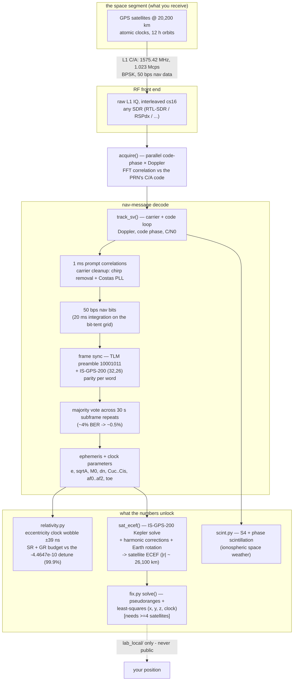

# GPSTuna 🛰️ — a software GPS receiver from raw SDR IQ

Point any SDR at 1575.42 MHz, record 90 seconds of the raw L1 hiss, and this
turns it into satellite orbits, a relativity experiment, and your position.
No GPS chip; just the antenna, the radio, and the math.

**Status: it works.** From a single 90 s capture on a cheap active patch
antenna in an attic, the full chain — acquisition → tracking → 50 bps nav
decode → ephemerides → pseudoranges → least-squares — produced a **7-satellite
position fix with 57 m residual rms** and a plausible altitude. Single
frequency, no ionosphere correction, one snapshot: that residual is the honest
physics of the measurement, not a rounding of somebody else's answer.

## What it does
- **Decodes the GPS nav message** from your own capture — ephemeris, clock terms,
  week number, timestamps — via preamble frame-sync, IS-GPS-200 parity, and a
  majority vote across the 30-second subframe repeats (drives ~4% bit errors to
  ~0.5%).
- **Measures Einstein.** `relativity.py` turns the decoded orbit into the
  satellite's relativistic clock behaviour: the ±39 ns per-orbit eccentricity
  wobble, and the special + general relativity budget — which matches the GPS
  factory clock detune (−4.4647×10⁻¹⁰) to **99.9%**. Time dilation, from a wire
  in the yard.

  
- **Computes satellite positions.** `fix.py`'s ephemeris→ECEF (Kepler + all
  harmonic corrections + Earth rotation) follows IS-GPS-200 Table 20-IV and
  cross-checks in full 3D against SGP4-propagated operational TLEs (1–3 km,
  the TLEs' own accuracy).
- **Solves your position.** Coarse transmit time from a linear fit across every
  parity-clean subframe anchor (fit residual doubles as a built-in truth check:
  microseconds = healthy), sub-millisecond from a common-epoch code-phase
  snapshot, satellite clock + relativistic corrections, Sagnac rotation, and an
  exhaustive integer-millisecond search scored by residual + altitude sanity.
- **Ionospheric scintillation** (`scint.py`) — S4 + phase indices from the same
  tracking, as a space-weather bonus.
- **Hears Galileo too.** `gal_e1.py` acquires Europe's constellation from the
  same 1575.42 MHz capture — E1-B/E1-C BOC(1,1) replicas, 4 ms coherent × 40
  noncoherent integration. First light: 4 Galileo birds confirmed in the same
  90 s file as the GPS fix, each with both independent codes agreeing on code
  phase and Doppler. (Spreading-code tables are fetched at runtime from
  gnss-sdr's GPL sources with attribution — not embedded in this MIT repo.)
- **Atmospheric corrections.** Troposphere always; Klobuchar ionosphere when
  the subframe-4 page-18 broadcast is caught (12.5-min cycle — capture long
  enough and it's guaranteed). `--multi N` solves at N snapshot epochs and
  averages in ECEF, with the epoch scatter reported as the honest error bar.

### Three lessons the working fix taught us (so you don't relearn them)
1. **Code phase points at the *next* code epoch** — transmit time assembles as
   `N − φ`, not `N + φ`. A sign, hidden inside 50 km of error.
2. **Code milliseconds tick on the satellite's clock, not GPS system time.**
   Assemble integer + fraction in SV time and subtract the clock correction
   *afterward* — `af0` alone spans ±0.5 ms (±150 km) if you subtract it first.
3. **Never trust `round()` for the integer millisecond.** Coarse times are
   ms-quantized per satellite; pin one reference bird and exhaustively search
   the relative integers — with ≥5 birds only the true set collapses the
   residuals *and* lands at a sane altitude.

## Architecture (full signal chain)


## Run it
```bash
python locate.py                                       # one command: capture -> count -> fix
python measure.py  --iq your_capture.cs16 --selftest   # sanity (synthetic -20 dB)
python relativity.py --iq your_capture.cs16            # decode Einstein
python fix.py --validate                               # satellite-position math
python fix.py --iq your_capture.cs16                   # position fix (>=4 birds)
python fix.py --resolve                                # re-solve from cache in seconds
```
Capture tip: an antenna at a window or a ~$10 active GPS patch antenna (bias-T
powered) sees 7–12 satellites; deep indoors you may see only 1–3. `--resolve`
reuses the cached pseudoranges from the last full run, so experimenting with
the solve never costs another 15-minute decode.

## Privacy
`fix.py` writes any computed position **only** to `lab_local/` (gitignored). The
IQ captures are gitignored too (satellite geometry encodes your location). The
code is public; your coordinates never are.

## The science — and the documents that define it

GPS is one of the rare engineering systems whose *entire* radio interface is
published, for free, by the government that built it. Every constant, bit layout,
and equation in this repo is traceable to those documents — which is exactly why
a receiver can be re-derived from scratch:

- **IS-GPS-200** (*Interface Specification, NAVSTAR GPS Space Segment / Navigation
  User Interfaces*, published by the U.S. Space Force / SMC, formerly ICD-GPS-200).
  This is the master document. It gives:
  - the **C/A code**: the 1023-chip Gold codes and each satellite's G2 phase-select
    taps — `measure.py` regenerates them and self-checks against IS-GPS-200's
    published first-10-chip octals.
  - the **nav-message format**: TLM preamble `10001011`, the 30-bit words, the
    (32,26) Hamming **parity** (§20.3.5.2), and the **subframe layouts** — bit
    positions and scale factors for every ephemeris/clock parameter. `relativity.py`
    and `fix.py` decode straight from these tables.
  - the **user algorithms** (Table 20-IV): ephemeris → ECEF satellite position
    (Kepler's equation + the harmonic corrections + Earth-rotation), and the
    **relativistic clock correction** `Δtr = F·e·√A·sin(E)` with the constant
    **F = −4.442807633×10⁻¹⁰ s/√m** used verbatim in `relativity.py`.
- **WGS-84** (the DoD World Geodetic System) supplies the Earth model: the
  gravitational parameter **μ = 3.986005×10¹⁴ m³/s²**, rotation rate
  **Ωe = 7.2921151467×10⁻⁵ rad/s**, and the ellipsoid used by `ecef_to_llh`.

### Who invented it
GPS grew out of the U.S. Department of Defense in the 1970s (the NAVSTAR program),
synthesizing earlier work like the Navy's **Transit** (Doppler positioning) and
**Timation** (satellite atomic clocks) and the Air Force's 621B. **Roger Easton**
(Naval Research Laboratory), **Bradford Parkinson** (the program's chief architect),
and **Gladys West** (whose geodetic modeling underlies WGS-84) are among its
central figures. It was declared fully operational in 1995 and opened to civilian
use — the reason this open-signal experiment is even possible.

### The relativity, in one paragraph
A satellite clock runs **slow** by ~7 µs/day from its orbital speed (special
relativity) and **fast** by ~45 µs/day from weaker gravity at altitude (general
relativity) — net **+38 µs/day**. GPS engineers pre-corrected for it by detuning
every satellite clock before launch by **−4.4647×10⁻¹⁰**. `relativity.py` computes
that same figure from the orbit *we decode ourselves* and matches it to **99.9%**;
without the correction, positions would drift **~11 km/day**. The system is, in
effect, a continuously-running verification of Einstein — and this repo reads it.

## Acknowledgments
- **IS-GPS-200 / WGS-84** — the U.S. government publishes GPS's entire radio
  interface for free; every equation here traces to those documents.
- **[laika](https://github.com/commaai/laika)** (comma.ai) — its pure-Python
  ephemeris→ECEF code was our line-by-line referee while debugging the fix.
- **[PocketSDR](https://github.com/tomojitakasu/PocketSDR)** (Tomoji Takasu),
  **[gnss-sdr](https://gnss-sdr.org/)**, and **Andrew Holme's homemade GPS
  receiver** — the open receivers whose existence proves this is doable and
  whose write-ups lit the path.
- **[python-sgp4](https://github.com/brandon-rhodes/python-sgp4)** + CelesTrak's
  operational TLEs — the independent orbit referee for validating `sat_ecef()`.

## Lineage
Built from the `radio-grid-atlas` GPS-L1 work; algorithms per **IS-GPS-200** and
**WGS-84**. Part of the "Tuna" family of open SDR tools
(hamTuna · wxTuna · setiTuna · GPSTuna).
